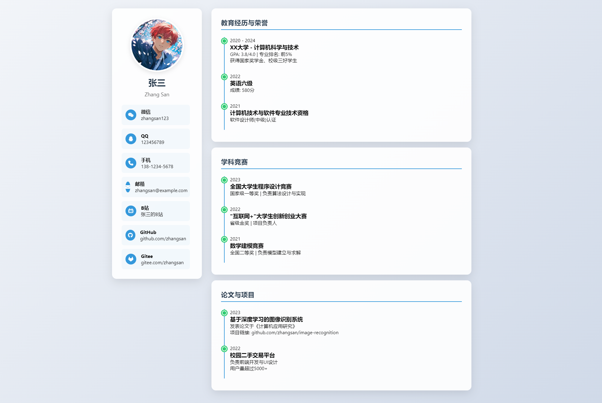

# 个人简历网站模板

这是一个用于展示个人职业信息的现代且视觉效果出色的个人简历网站模板。该模板使用HTML和CSS构建，并包含动画和响应式设计功能，以提升用户体验。

## 功能特点

- **响应式设计**：模板在所有设备上都能完美显示，包括桌面电脑和移动手机。
- **动画效果**：包含平滑的动画效果，使网站更加吸引人。
- **可定制**：您可以轻松地自定义内容和样式，以匹配您的个人品牌。
- **图标**：使用Font Awesome图标，使设计更加现代和专业。

## 快速开始

1. **克隆仓库**：将此仓库克隆到您的本地机器。
   ```bash
   git clone https://github.com/weigo6/resume-site.git

## 预览链接

⚡电子名片网页预览：[个人简历 - 张三 (weigo6.github.io/resume-site/)](https://weigo6.github.io/resume-site/)

## 示例图片


